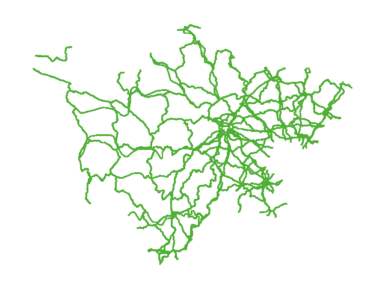
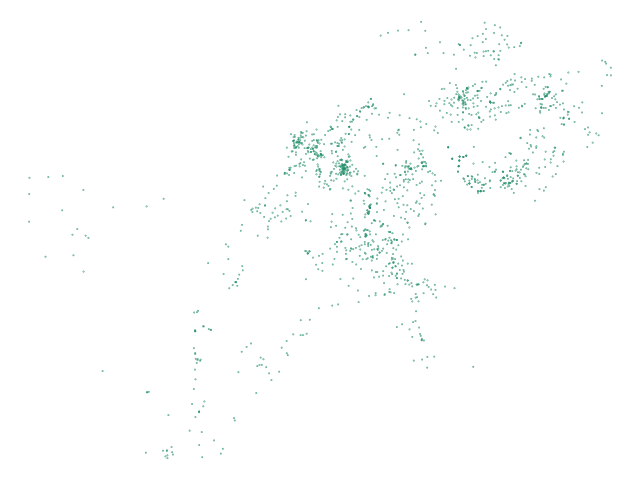
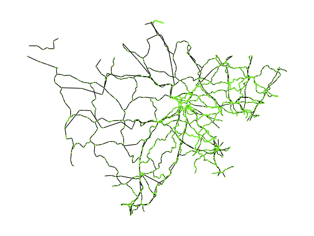
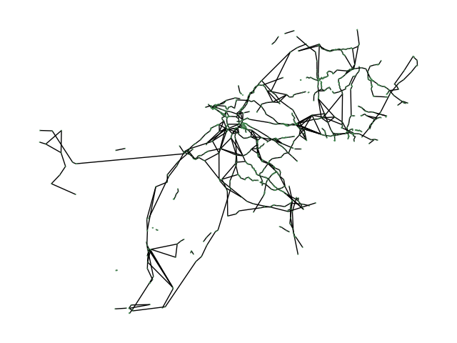

**高速公路网络拓扑快速生成说明文档**

# **1. 简介**
浙江师范大学余老师团队目前已构建高速公路网络拓扑模型。借助公路养护电子地图数据和国家公路网矢量数据，我们已初步实现了面向规划研究的网络拓扑快速生成技术，并建立了典型路网拓扑模型。

构建国道高速公路枢纽点网络时，我们以一个例子来更好地说明。在这个过程中，我们需要利用两个文件来建立这个网络。这两个文件的作用分别如下：

`	`**1) Road\_G**

该文件包含了四川省国道的基础网络数据。它涵盖了CROWID（唯一标识符）、geometry（线段的经纬度信息），以及其他100余列属性数据。

`	`**2) JTLJDP**

这个文件则包含了四川省国道枢纽点的节点信息。这些枢纽点包括高速公路的出入口、养护站、客运站等。文件中同样包含CROWID（唯一标识符）、geometry（节点的经纬度信息），以及其他30余列属性数据。

# **2. 构建工具**
我们主要使用了python来完成整个网络拓扑快速生成技术。其中主要使用了Geopandas、Geopy、Matplotlib、**NetworkX**等第三方库，具体介绍如下：

\1) Geopandas

Geopandas结合了Pandas的数据处理能力和地理空间数据的功能，可轻松处理GIS数据。通过它，用户能读取、写入、分析和可视化地图上的各种地理要素（点、线、多边形等），进行空间数据操作、投影转换，并使用类似Pandas的操作方式处理地理信息系统（GIS）数据。

\2) Geopy

Geopy可以处理地理编码和逆地理编码，转换地理位置描述为坐标（地理编码），或将坐标转为位置描述（逆地理编码）。获取经纬度、计算距离、查找国家、州或城市等信息。

\3) Matplotlib

Matplotlib可以创建各类图表和可视化呈现。轻松将数据可视化，助用户更直观理解数据关系。其灵活性和定制性允许自定义外观、标签、标题、网格线等，制作高质量图形。广泛应用于数据分析、科学计算、工程领域和学术研究。

\4) NetworkX

NetworkX用于创建、操作和研究复杂网络（图）。它支持有向图、无向图、加权图等结构，能添加节点和边，计算网络属性，进行遍历、分析和可视化。对于构建高速公路网络等复杂网络有帮助。简单易用、功能强大，适用于网络结构、社交、交通、生物等领域的分析建模。

# **3. 构建思路及内容**
构建国道高速公路枢纽点网络主要分为四个步骤：构建国道高速公路道路基础网络、构建四川省枢纽点基础网络(无连边)、构建国道高速公路道路的简化网络、构建国道高速公路枢纽点网络。

## **3.1 构建国道高速公路道路基础网络**
`	`处理地理空间数据时，首先要用到一个名为 Road\_G.shp 的文件。我们用到这个文件中的路径的几何信息，也就是路径的形状，以及路径上各个节点的经纬度信息。每条路径都由一系列连接在一起的节点组成，每个节点都有它自己的经度和纬度信息。

为了对这些路径进行处理，我们需要给每条路径上的点分配一个唯一的编号，这个编号由两部分组成。首先是路径的唯一标识符（CROWID）。然后，为了确保每个节点在路径中都有一个唯一的标识，我们会使用节点在路径中的索引位置来构成编号。这个编号的格式是 CROWID@ 加上当前节点在路径中的索引位置。

为此我们构造出了国道高速公路道路基础网络图，如下图：

为了详细描述国道高速公路的路网结构，我们建立了一张道路基础网络图，如下所示：在我们的工作中，我们将这个国道高速公路道路基础网络的连接关系和相应的经纬度信息分别保存在了两个文件中，分别为‘Road\_JTLJDP\_Road\_G\_graph.txt’和‘Road\_JTLJDP\_Road\_G\_positions.txt’。

## **3.2 构建四川省枢纽点基础网络(无连边)**
在这个步骤中，我们导入了名为JTLJDP.shp的文件，并提取了每个点的唯一标识符CROWID以及相关节点的信息。如下图：

节点的唯一标识符和位置信息对于地理信息系统分析和地理定位至关重要。为了更有效地管理和利用这些数据，我们将节点的标识符和位置信息分别存储在两个文件中：

'Point\_JTLJDP\_Road\_G\_graph.txt'和'Point\_JTLJDP\_Road\_G\_positions.txt'。

这些文件为进一步的地理信息系统分析奠定了基础，为节点数据的系统化管理提供了必要支持。

## **3.3 构建国道高速公路道路的简化道路网络**
`	`在建立最终国道高速公路枢纽点网络的过程中，首要任务是将3.2中的枢纽点基础网络中的每个节点精确映射到3.1国道高速公路道路基础网络图上最接近的对应节点。鉴于数据量庞大可能导致的巨大时间消耗，我们引入了机器学习算法中的KD树算法来精确实现这一映射过程。KD树算法通过构建高效的KD树数据结构，在庞大的节点数据集中快速定位每个节点在道路基础网络图上最近的对应节点。这种算法的应用极大地优化了映射过程，为构建更完善的网络提供了可靠且高效的基础。

其次，考虑到3.1中构建的国道高速公路道路基础网络点数过于庞大，在短距离路段上可能存在数百个节点。这造成了大量冗余数据，给后续最终国道高速公路枢纽点网络的构建带来了巨大的时间开销。为了解决这一问题，我们从原3.1中国道高速公路道路基础网络图中提取了路段边界点、交叉口点以及前述映射的路网点，并构建了一个简化的国道高速公路道路网络。经过测量验证，这一简化网络大幅减少了后续构建国道高速公路枢纽点网络的耗时，达到了超过95%的时间节约效果。构建的简化道路网络如下：

我们将简化后的道路网络的图结构以及每个节点的经纬度信息分别保存在了两个文件中：Simplify\_road\_JTLJDP\_Road\_G\_graph.txt和Simplify\_road\_JTLJDP\_Road\_G\_positions.txt。这个操作对我们构建更高效、更精确的网络起到了关键作用，通过保存图结构和节点地理位置信息，我们能够更好地理解和利用这些数据，为后续的分析和处理提供了可靠的基础。

## **3.4 构建国道高速公路枢纽点网络**
`	`为了确定枢纽点在道路基础网络上的连接关系，我们利用最短路径技术在简化后的道路网络中进行构建。这个过程涉及到寻找枢纽点之间的最短路径。例如，考虑一个枢纽点的集合S。假设我们需要确定集合中点a和点b之间的图结构关系，我们首先找到a与b之间的最短路径。假设最短路径为a, x, u, i, y, b。如果我们发现最短路径中的点x也包含在枢纽点集合S中，那么我们可以确定路径的图结构关系为a与i相连，i与b相连。这个过程也需要考虑连边的权重，即在实际路网中枢纽点与枢纽点之间的实际里程。

为了确定连边之间的权重，我们需要截取最短路径中的某段路径，并计算这段路径上两两点之间的距离差值。例如，我们发现a与i之间有连接，我们会在最短路径中截取一段路径，比如[a, x, u, i]，然后对这段路径上的每两个点进行经纬度差值计算。最后，将这些距离差值相加，计算出两枢纽点之间的实际里程。这个实际里程将作为构建最终国道高速公路枢纽点网络图中的边权，用于描述网络中不同节点之间的实际连接距离。构建的国道高速公路枢纽点网络图如下：

最后，我们将构建的国道高速公路枢纽点网络的最终图结构关系以及权重信息，保存在了Composite\_JTLJDP\_Road\_G\_graph.txt文件中。这个文件记录了节点之间的连接方式，以及连接间的实际里程数据，为我们提供了对网络结构和距离的详细了解。同时，节点的地理位置信息则被存储在了Composite\_JTLJDP\_Road\_G\_positions.txt文件中。这个文件记录了每个节点的精确经纬度数据，为我们提供了对网络节点地理位置的准确描述。

# **-附录-**

**如何查看构建网络的具体构建流程？**

出于安全考虑，本项目源代码仅对内部人员开放，存储于Github的私有仓库中。如果您有兴趣了解构建拓扑网络的完整流程，请发送您的Github信息至wangyunhenggxy@zjnu.edu.cn，我们会尽快为您分配权限。之后您可以在项目地址 https://github.com/Yunheng-Wang/Expressway 查看该项目。

**文中提到的文件去哪里找？**

若需要查阅文中提及的文件，请查看随本说明文档一同打包的docs目录。
